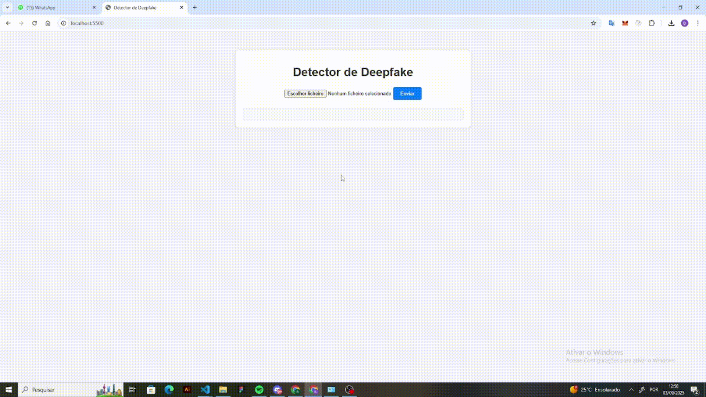

# 🕵️‍♂️ Deepfake Detector – ConvNeXt AI

🚀 Um sistema de detecção de **deepfakes em imagens** usando PyTorch, FastAPI e um modelo ConvNeXt pré-treinado.
O projeto integra um backend em Python que carrega o modelo e processa imagens, com um frontend simples em HTML/CSS/JS para envio e visualização dos resultados.

## ✨ Funcionalidades
- Upload de imagens diretamente no navegador.
- API em **FastAPI** que processa e retorna o resultado da detecção.
- Separação clara entre **frontend** e **backend**.
- Fácil de rodar localmente.

## 📸 Demonstração


## O modelo classifica a imagem em ORIGINAL ou uma das técnicas de deepfake:
- FACE2FACE
- FACESHIFTER
- FACESWAP
- DEEPFAKEDETECTION
- DEEPFAKES
- NEURALTEXTURES

## ⚙️ Tecnologias Utilizadas

Backend: Python, FastAPI, PyTorch, timm

Frontend: HTML, CSS, JavaScript (Fetch API)

Modelo: ConvNeXt pré-treinado e ajustado para 7 classes

Infra: Uvicorn (servidor ASGI)

## 🚀 Como Rodar Localmente
1. Clone o repositório

```bash
git clone https://github.com/seu-usuario/deepfake-detector.git
cd deepfake-detector
```

2. Configure o backend

Crie e ative um ambiente virtual:
```bash
cd backend
python -m venv venv
# Ativar venv:
# Windows (PowerShell):
venv\Scripts\activate
# Linux/Mac:
source venv/bin/activate
```
Instale as dependências:
```bash
pip install -r requirements.txt
```

3. Rode o backend
```bash
python app.py
```

O servidor estará rodando em:
👉 http://127.0.0.1:8000

4. Rode o frontend

Abra frontend/index.html com Live Server (VSCode)
ou use um servidor simples:
```bash
cd frontend
npx http-server .
```

O front abrirá em http://127.0.0.1:5500/ (Live Server) ou http://127.0.0.1:8080/ (http-server).

## 5. 🚀 Teste Rápido via Python

Também é possível testar sem o front:
```bash
cd backend
python test_request.py
```

## ✨ Melhorias Futuras

 Adicionar suporte a vídeos (análise frame a frame)
 Criar interface em React ou outro framework
 Explicar a decisão do modelo com técnicas de Explainable AI (Grad-CAM, LIME)
 Deploy em nuvem (Render, AWS, GCP ou HuggingFace Spaces)

## 📝 Licença

Este projeto está sob a licença MIT.
